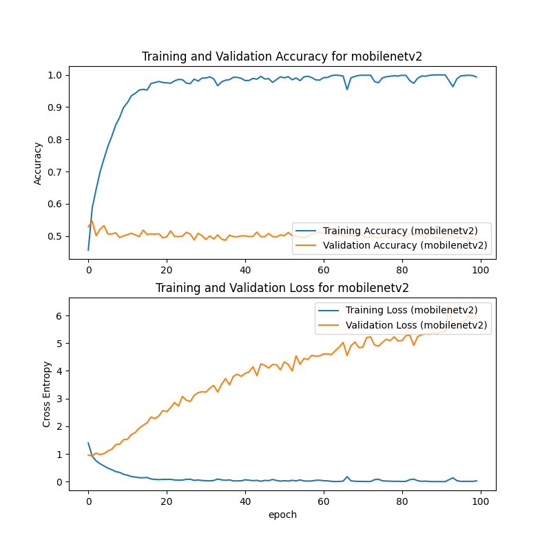
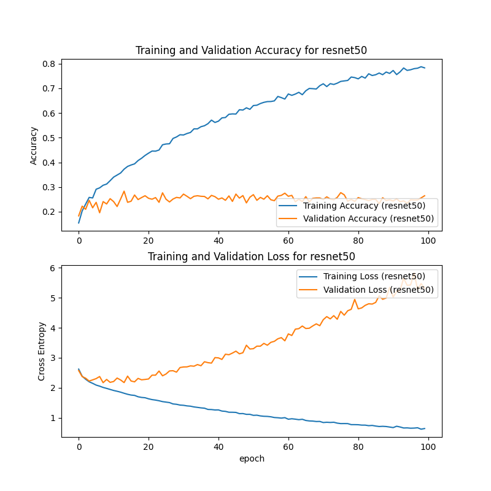
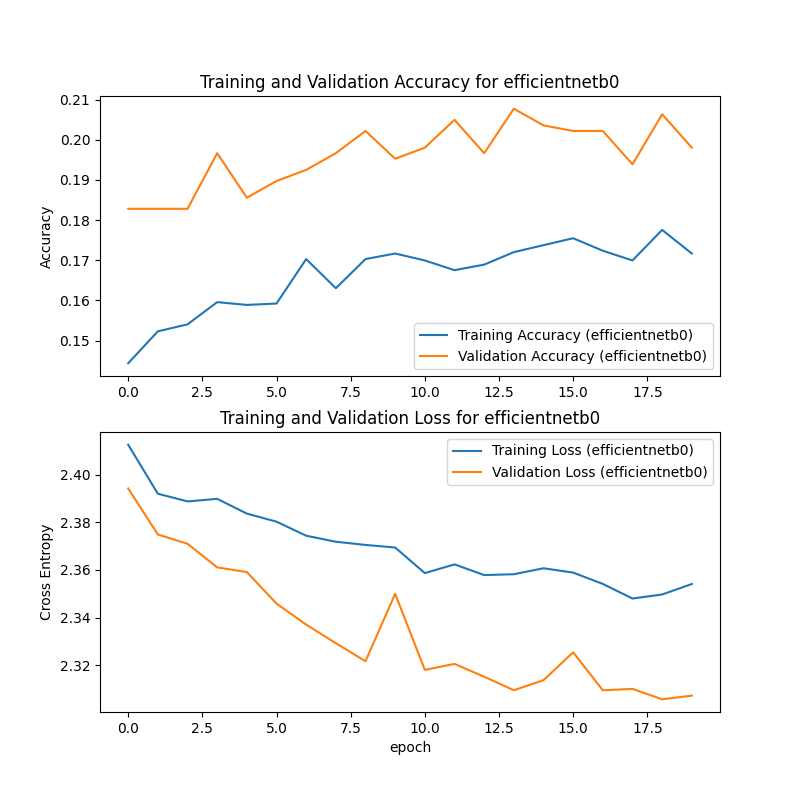
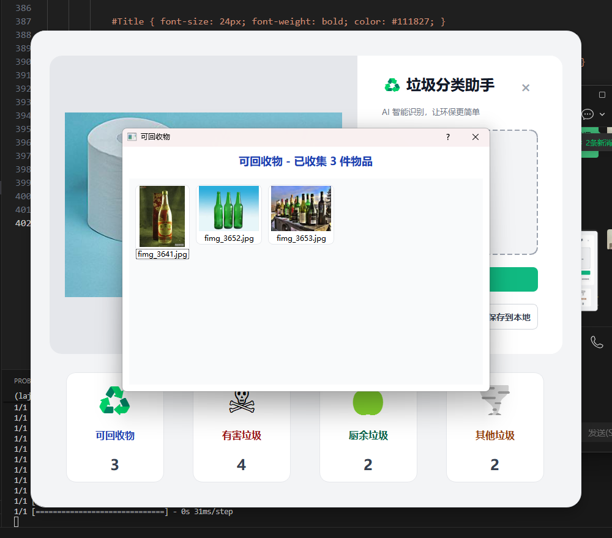

# 垃圾分类系统

本项目基于Tensorflow实现了ResNet50、mobilenetv2、efficientnetb0，主要用于解决**垃圾分类**问题。

## 1. Requirements: Software (软件需求)

本项目在 **Python3.8** 和 **Tensorflow2.10** 环境下开发。请按照以下步骤配置环境：

### 基础依赖

建议使用 Anaconda 创建虚拟环境：

```bash
# 创建虚拟环境
conda create -n laji python=3.8 -y

# 激活环境
conda activate laji

# 安装 CUDA
conda install -c conda-forge cudatoolkit=11.2 cudnn=8.1.0

# 安装Tensorflow、opencv等
pip install -r requirements.txt
```

**主要的依赖库包括：**

* numpy
* opencv-python
* matplotlib

---

## 2. Pretrained Models (预训练模型)

我们在以下数据集上进行了训练，并提供了训练好的模型权重文件。

### 模型下载

由于 GitHub 文件大小限制，部分模型权重文件存储在云盘中。

| Model Name | mAP / Acc | Checkpoint Size | Download |
| --- | --- | --- | --- |
| **ResNet50** | 78.5% | 90 MB | [点击下载 (.h5)](https://pan.quark.cn/s/5e2ff09a817e) |
| **MobileNetV2** | 99.1% | 9 MB | mobilenetv2.h5 |
| **EfficientNetb0** | 20.6% | 20M |efficientnetb0.h5 |

### 模型放置

下载完成后，请将模型权重文件放入项目的目录中：

```bash
# 将下载的 .h5 文件移动到该文件夹
# 例如: ./best_model.h5

```

### 模型效果

MobileNetV2



RestNet50



EfficientNetb0



### 3.训练

### 3.1 数据准备 (Data Preparation)

将图片数据放入 `laji1` 文件夹中。

```text
├── laji1/             
│   ├── category1/       # 种类1
|       ├──img1.jpg      # 图片
|       ├──img2.jpg      # 图片
|       '''
|       └──imgn.jpg      # 图片
│   ├── category2/       # 种类2
|       ├──img1.jpg      # 图片
|       ├──img2.jpg      # 图片
|       '''
|       └──imgn.jpg      # 图片

```

### 3.2数据划分

使用以下命令运行数据划分脚本：

**基本测试命令：**

```bash
python data.py

```

### 3.3训练

使用以下命令运行训练脚本：

**基本测试命令：**

```bash
python train.py

```

---

## 4. Preparation for Testing (测试准备)

本节将指导你如何使用提供的代码和模型进行推理（Inference）或测试。

### 运行 (Run)

使用以下命令运行垃圾分类系统：

**基本测试命令：**

```bash
python main.py
```

### 结果查看




---

## 5. Project Structure (项目结构)

关键模块的代码结构如下：

```text
├── laji1/              # 原数据集存放路径
├── laji2/              # 训练数据集 
│   ├── test/           # 测试集
│   └── train/          # 训练集
├── efficientnetb0_laji.h5 # EfficientNetb0的参数
├── resnet50_laji.h5    # ResNet50的参数
├── mobilenetv2_laji.h5 # MobileNetV2的参数
├── data.py             # 对原数据集进行划分
├── train.py            # 训练脚本
├── main.py             # 分类系统
├── requirements.txt    # 环境依赖表
└── README.md           # 项目说明文档

```


